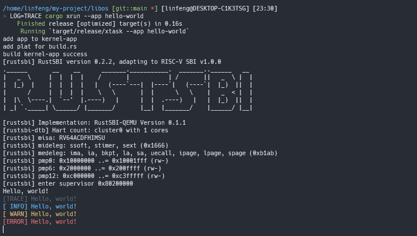
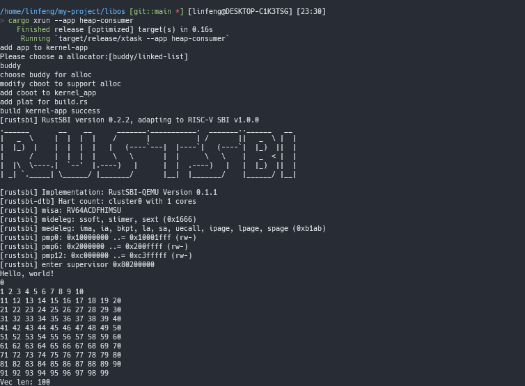

# LibOS

libos的简单尝试。尝试使用`rust`的条件编译选项与`cargo add/rm` 工具完成。

## 功能

- 一个打印字符的`hello world`程序
- 一个使用堆分配的程序

## 设计思路：

 对于打印功能来说，在`plat/cconsole`中定义了一个`Stdio`的`trait`,在不同平台上需要实现此接口，同时不同的平台还应该提供一个`boot0`的宏和`linker`文件，`libs/cboot`会完成应用程序运行前的初始化工作，其将所有的平台实现作为依赖导入，通过`cfg`选项，选择导入不同的平台的启动代码，并初始化平台相关的串口打印功能。

`kernel-app`是一个模板`crate` ，其内部的代码只有两行:

```rust
#[no_mangle]
pub unsafe fn rust_main()->!{
    //启动准备
    cboot::boot();
    //程序运行
    app::app_main();
    loop {}
}
```

所有的`app`以相同的`app_main()`作为入口函数。在运行选择的程序时，使用`cargo add`命令修改`kernel-app`的依赖项将不同的app重命名为`app`，此命令也可以添加`feature`。


对于堆分配功能来说，如果用户程序直接导入`alloc`模块功能，则构建程序无法发现应用程序需要启用堆分配，这里选择在`libs`定义了一个`calloc-trait`，重新导出`alloc`功能，这样让应用程序通过引入我们定义的库去使用`alloc`中数据结构，我们就可以从应用程序的依赖中发现应用程序需要堆分配功能。在这个系统中我们模拟了两个可用的堆分配，两个库都在`crates.io`可以找到，同样的，这个堆分配功能也在`cboot`中通过编译选项导入，在构建程序发现用户程序需要堆分配时会询问用户使用哪个堆分配器，在两个堆分配器的实现`calloc_impl`中也是用条件编译进行导出。

```rust

#[cfg(feature = "buddy")]
pub type Allocator = buddy::BuddyAllocator;

#[cfg(feature = "linked-list")]
pub type Allocator = link_list::LinkAllocator;

```


## 构建

1. 确保安装了`cargo-edit`
2. 安装`qemu-system-riscv64`

3. 选择应用程序


## 示例

### hello-world



### heap-consumer

这里选择使用伙伴分配器。




## 错误

目前的`xtask`逻辑有些混乱需要修改。
